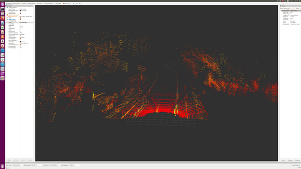

# Multiple-LiDARs-Merger
This repository is to merge multiple LiDAR point cloud data into one frame for each timestep using Python and rosbag package.

Raw LiDAR Data             |  Merged LiDAR Data
:-------------------------:|:-------------------------:
     |  

## Requirements
0. ROS Kinetic
1. Python 2.7.12
2. Python 3.7 or newer

## How to Run the Script
0. Git clone the repository
1. Move bag files to the rosbag folder
2. Open the main.py script
3. Edit the line 5 and 8 to rename the imported and output bags' name.